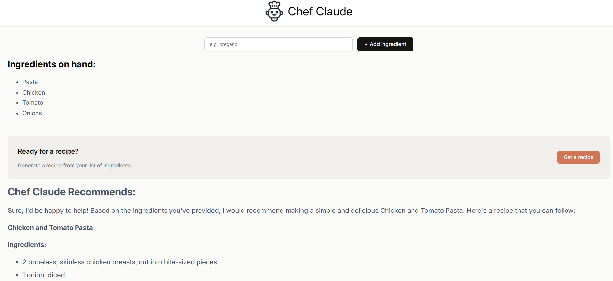
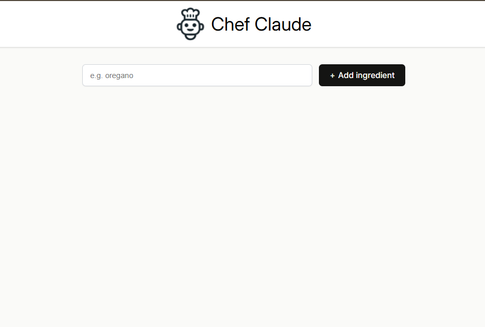

Chef-Claude-App is an intuitive recipe suggestion tool powered by AI. Users can provide a list of ingredients they have on hand, and the app will generate creative and detailed recipes based on those ingredients. The app leverages advanced AI models to deliver tailored cooking recommendations formatted in markdown for easy readability.

Key Features:
- Ingredient-Based Suggestions: Enter ingredients, and Chef-Claude-App crafts recipes using some or all of them.
- AI-Powered Recommendations: Utilizes state-of-the-art AI for recipe generation, ensuring variety and creativity.
- Markdown Output: Recipes are displayed in a clean and structured format for better readability.
  
Technologies Used:
- React: For building a dynamic and responsive front-end.
- Vite: For fast and efficient development and bundling.
- AI API Integration: To connect with models like Hugging Face for recipe suggestions.
- Netlify: For seamless deployment and hosting.
  
How to Use:
Enter your ingredients in the input field.
Submit to get a personalized recipe.
Enjoy exploring new culinary ideas!
